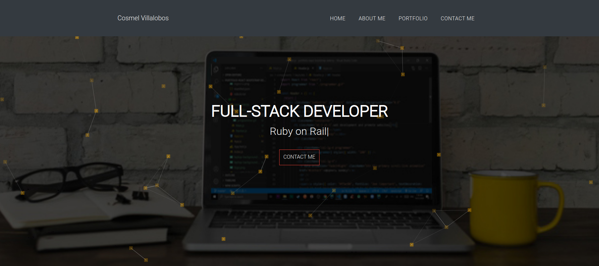

# Portfolio

> Building my portfolio using React and Bootstrap.

## Built With

- React,
- Bootstrap

## Live Demo

[Live Demo Link](https://livedemo.com)

## Getting Started

**To get a copy of this template you can just click on the green button on top right corner that says code**
**Open you teminal and type this code `git clone git@github.com:cvilla714/portfolio.git`**
**Last thing is to go insid the directory were the project is please type `cd portfolio`**

### Prerequisites

- NodeJs
- Npm
- React

### Install

**_To install all of the dependecies and run the project pleaes type the following command in your terminal `npm install`_**

### Usage

**_After all dependecies are install you can then proceed to run the following command `npm run start`_**

## Authors

👤 **Cosmel Villalobos**

- Github: [@cvilla714](https://github.com/cvilla714)
- Twitter: [@kckeyti](https://twitter.com/kckeyti)
- LinkedIn: [Cosmel Villalobos](https://www.linkedin.com/in/cosvilla/)

## 🤝 Contributing

Contributions, issues and feature requests are welcome!

Feel free to check the [issues page](https://github.com/cvilla714/portfolio/issues).

## Show your support

Give a ⭐️ if you like this project!

## Acknowledgments

- Andrey Dovganyuk **_I applied what I learned from this Udemy Course_**

## 📝 License

This project is [MIT](https://github.com/cvilla714/portfolio/blob/master/LICENSE) licensed.
